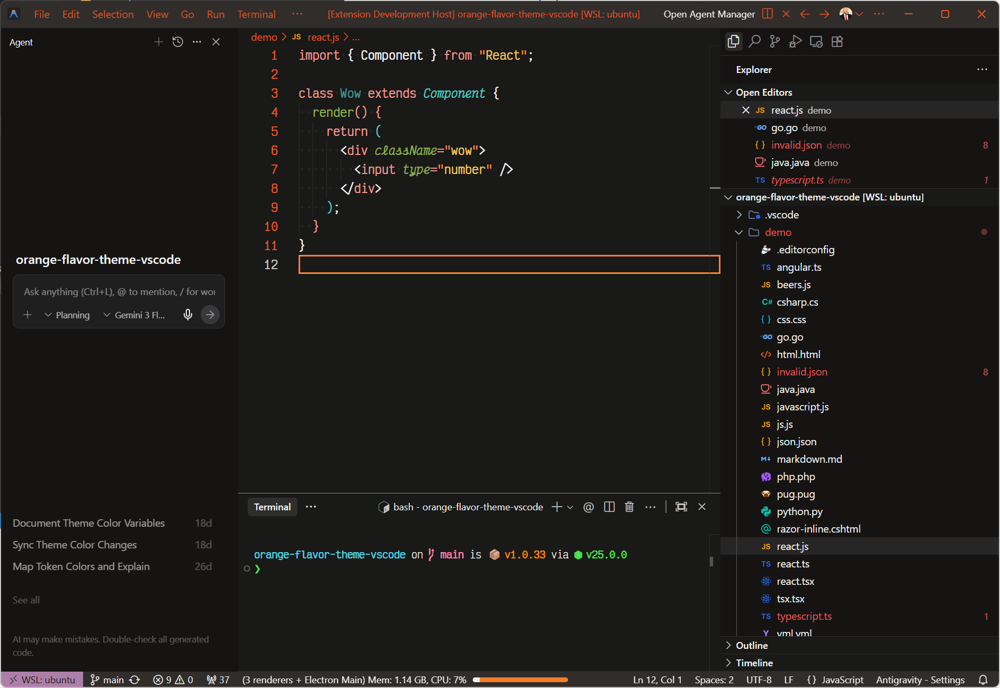
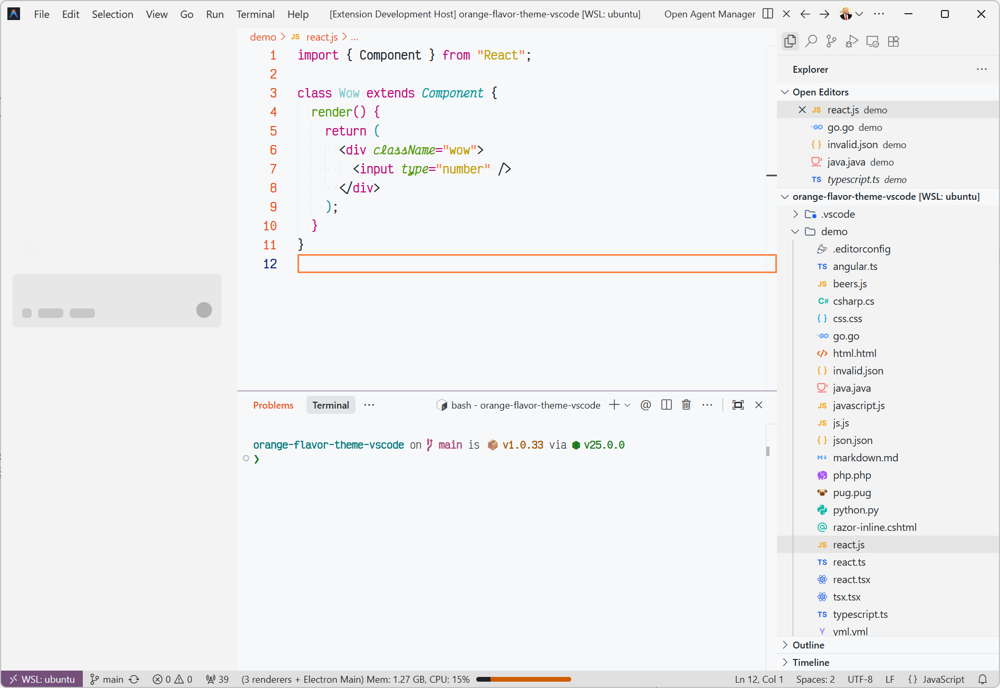

<div align="center">
  <h1>Humans Theme</h1>

[](https://marketplace.visualstudio.com/items?itemName=enbonnet.humans-theme)
[](https://open-vsx.org/extension/enBonnet/humans-theme)
[](https://marketplace.visualstudio.com/items?itemName=enbonnet.humans-theme)

  
</div>

## Table of Contents

- [Features](#features)
- [Preview](#preview)
- [Color Palette](#color-palette)
- [UI Variants](#ui-variants)
- [ANSI Terminal Colors](#ansi-terminal-colors)
- [Supported Languages](#supported-languages)
- [Installation](#installation)
- [Using the Theme](#using-the-theme)
- [Recommended Settings](#recommended-settings)
- [Development](#development)
- [Contributing](#contributing)
- [Credits](#credits)
- [License](#license)

## Features

- **Warm, humanist palette** — Earthy tones and energetic orange accents (`#e95421`, `#ff8142`) on a deep charcoal background, designed to feel alive and organic
- **Two variants** — Dark (`Humans`) and Light (`Humans Light`), each with a fully independent color system
- **Semantic highlighting** — Fine-grained TextMate scoping with dedicated token colors for over 25 languages
- **Eye comfort** — Soft contrast ratios reduce strain during long coding sessions without sacrificing readability

## Preview

### Humans (Dark)
<div align="center">
  
</div>

### Humans Light
<div align="center">
  
</div>

## Color Palette

This theme uses a warm, humanist palette drawn from organic materials — clay, charcoal, moss, amber, and rose:

| Role | Color Name | Hex | Preview |
|------|------------|-----|---------|
| Background | Deep Charcoal | `#191917` |  |
| Foreground | Off-White | `#f3f3f3` |  |
| Selection | Bright Orange | `#ff8142` |  |
| Comments | Burnt Orange | `#e95421` |  |
| Cyan | Soft Teal | `#50cbc3` |  |
| Green | Leaf Green | `#8fb04f` |  |
| Orange | Warm Orange | `#f27e2a` |  |
| Pink | Soft Rose | `#e858bc` |  |
| Purple | Muted Purple | `#ad7fa8` |  |
| Red | Muted Red | `#e85858` |  |
| Yellow | Soft Amber | `#f2c55c` |  |

## UI Variants

| Variable | Hex | Purpose |
|----------|-----|---------|
| BGDarker | `#302d2b` | Widgets, inputs |
| BGDark | `#151413` | Sidebar, panels |
| BG | `#191917` | Main editor background |
| BGLight | `#20201e` | Mid-tone background |
| BGLighter | `#5a5654` | Hover states, highlights |

## ANSI Terminal Colors

| ANSI | Name | Normal | Bright |
|------|------|--------|--------|
| 0 / 8 | Black | `#1f2328` | `#808080` |
| 1 / 9 | Red | `#ff8142` | `#ff5e26` |
| 2 / 10 | Green | `#32cd32` | `#4ee44e` |
| 3 / 11 | Yellow | `#ffd700` | `#ffeb3b` |
| 4 / 12 | Blue | `#1e90ff` | `#42a5f5` |
| 5 / 13 | Magenta | `#ff69b4` | `#ff80ab` |
| 6 / 14 | Cyan | `#00ced1` | `#4dd0e1` |
| 7 / 15 | White | `#ffffff` | `#ffffff` |

## Supported Languages

| Language | Explicit TextMate Scoping Rules |
|----------|-------------------------------|
| C | `storage.type.c`, `keyword.operator.dereference` |
| C# | `keyword.type.cs`, `storage.type.cs`, `punctuation.definition.tag.cs` |
| CSS | `entity.other.attribute-name`, `meta.selector`, `punctuation.separator.list.comma.css` |
| CoffeeScript | `meta.variable.assignment.destructured.object.coffee` |
| F# | `keyword.other`, `variable.other`, `constant.language.unit` |
| Go | `source.go storage.type`, `storage.type` |
| GraphQL | `meta.selectionset.graphql`, `meta.arguments.graphql`, `entity.name.fragment.graphql`, `punctuation.colon.graphql` |
| Groovy | `meta.method.groovy`, `source.groovy storage.type.def`, `keyword.operator.navigation.groovy` |
| Haskell | `storage.type.haskell`, `constant.language.empty-list.haskell`, `meta.preprocessor.haskell` |
| HTML | `entity.name.tag`, `entity.other.attribute-name` |
| Java | `meta.method-call.java meta.method`, `source.java storage.type`, `storage.modifier.import`, `storage.type.generic.java` |
| JavaScript | `punctuation.section.embedded.jsx`, `variable.other.constant.js`, `meta.function-call` |
| JSX | `punctuation.section.embedded.begin.jsx`, `punctuation.section.embedded.end.jsx` |
| Lua | `support.function.any-method.lua` |
| Makefile | `punctuation.definition.variable.makefile`, `entity.name.function.target.makefile`, `meta.scope.prerequisites.makefile` |
| Markdown | `markup.heading`, `markup.bold`, `markup.italic`, `markup.inline.raw`, `markup.quote`, `markup.underline.link`, `fenced_code.block.language` |
| Objective-C | `meta.implementation storage.type.objc`, `meta.interface-or-protocol storage.type.objc`, `meta.protocol-list.objc`, `meta.return-type.objc` |
| OCaml | `storage.type.ocaml` |
| Perl | `constant.other.key.perl` |
| PHP | `meta.function-call.php`, `punctuation.terminator.expression.php`, `storage.type.php`, `meta.function.arguments variable.other.php` |
| PowerShell | `keyword.other.other.powershell`, `keyword.other.statement-separator.powershell`, `source.powershell entity.other.attribute-name`, `support.constant` |
| Python | `string.quoted.docstring.multi.python`, `constant.character.escape` |
| reStructuredText | `punctuation.definition.link.restructuredtext`, `markup.raw.restructuredtext`, `meta.link.reference.def.restructuredtext`, `punctuation.definition.directive.restructuredtext`, `entity.name.directive.restructuredtext`, `punctuation.definition.constant.restructuredtext` |
| Ruby | `variable.other.readwrite.instance.ruby`, `constant.other.symbol.hashkey.ruby`, `punctuation.definition.constant.ruby` |
| Rust | `storage.class.std.rust`, `storage.type.core.rust` |
| SCSS | `meta.at-rule.function variable`, `meta.at-rule.mixin variable`, `meta.attribute-selector.scss`, `punctuation.definition.attribute-selector` |
| Shell | `source.shell variable.other`, `meta.scope.for-loop.shell` |
| Swift | `keyword.expressions-and-types.swift`, `keyword.primitive-datatypes.swift`, `storage.type.attribute.swift`, `punctuation.function.swift` |
| TOML | `meta.group.double.toml`, `meta.group.toml`, `entity.name.section.toml`, `variable.other.key.toml`, `constant.other.date`, `constant.other.timestamp` |
| TypeScript | `variable.other.constant.ts`, `variable.other.constant.tsx`, `meta.type.parameters entity.name.type`, `meta.indexer.mappedtype.declaration entity.name.type` |
| TSX | `punctuation.section.embedded.begin.tsx`, `punctuation.section.embedded.end.tsx` |
| YAML | `entity.name.tag.yaml`, `punctuation.definition.block.scalar.folded.yaml`, `punctuation.definition.block.sequence.item.yaml`, `punctuation.separator.key-value.mapping.yaml`, `variable.other.alias.yaml` |

Additional languages are covered by general-purpose scoping rules (comments, strings, keywords, constants, functions, variables, types, and storage modifiers).

## Installation

### VS Code Marketplace
[](https://marketplace.visualstudio.com/items?itemName=enbonnet.humans-theme)

### Open VSX Registry
[](https://open-vsx.org/extension/enBonnet/humans-theme)

## Using the Theme

1. Open the Command Palette (`Ctrl+Shift+P` or `Cmd+Shift+P`)
2. Type **"Preferences: Color Theme"** and press Enter
3. Search for **"Humans"**
4. Select either **"Humans"** (dark) or **"Humans Light"** from the list

## Recommended Settings

For the best experience, add these to your `settings.json`:

```json
{
  "workbench.colorTheme": "Humans",
  "editor.fontFamily": "'Victor Mono', Monaco, Menlo, 'Courier New', monospace",
  "editor.fontSize": 16,
  "editor.lineHeight": 1.5,
  "editor.fontWeight": "600"
}
```

## Development

### Prerequisites

- [Node.js](https://nodejs.org/) (v18+)
- [pnpm](https://pnpm.io/)

### Setup

```bash
# Install dependencies
pnpm install

# Build the theme
pnpm run build

# Watch for changes and rebuild automatically
pnpm run watch

# Package the extension
pnpm run package
```

### Project Structure

```
.
├── src/
│   └── humans.yml              # Theme source (YAML with YAML anchors)
├── theme/
│   ├── humans.json             # Generated dark theme
│   └── humans-light.json       # Generated light theme
├── scripts/
│   ├── build.js                # Build entry point
│   ├── generate.js             # Theme generator (handles YAML → JSON + light variant transform)
│   └── lint.js                 # Lint script
├── images/
│   ├── icon.png                # Extension icon
│   └── screenshots/
│       ├── dark.png
│       └── light.png
├── docs/                       # Static landing site (GitHub Pages)
│   ├── index.html
│   ├── languages.html
│   └── css/
│       └── style.css
└── package.json
```

## Contributing

Contributions are welcome! If you find any issues or have ideas for improvements:

1. Open an [issue](https://github.com/enBonnet/humans-theme-vscode/issues)
2. Submit a pull request
3. Share your feedback

## Credits

- Inspired by humanist design and organic aesthetics
- Based on the [Dracula Theme](https://draculatheme.com/) schema, with colors adapted for the Humans aesthetic
- Special thanks to the VS Code community for their theming support

## License

This project is licensed under the MIT License — see the [LICENSE](LICENSE) file for details.

---

<div align="center">
  Made with 🔥 by <a href="https://enbonnet.com">Ender Bonnet</a>
</div>
